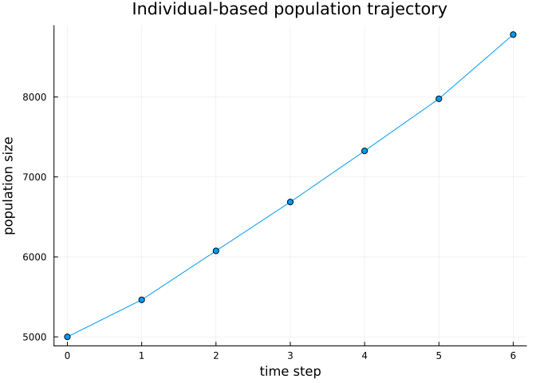
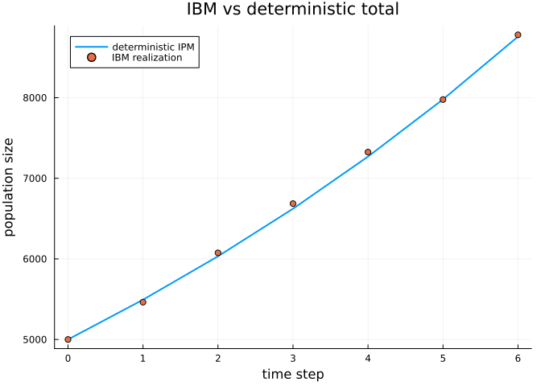
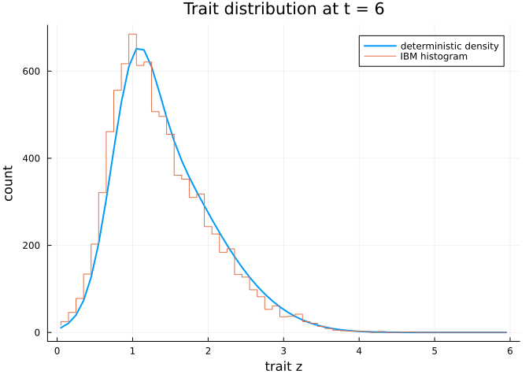

# Individual-based realizations of structured populations
Simon Frost

- [Overview](#overview)
- [Setup](#setup)
- [Vital rates and domain](#vital-rates-and-domain)
- [Building and running an IBM](#building-and-running-an-ibm)
- [Comparison with the deterministic
  IPM](#comparison-with-the-deterministic-ipm)
- [Eviction and small populations](#eviction-and-small-populations)
- [Summary](#summary)

## Overview

**IndividualBasedPopulationDynamics.jl** realizes structured population
models as *individual-based models* (IBMs) on the
[Ark.jl](https://github.com/ark-ecs/Ark.jl) entity-component-system.
Each individual is an entity carrying a continuous `Size` trait; birth
spawns an entity, death despawns one, and growth updates the trait.

This is the finite-$N$ “ground truth” whose large-$N$ limit is the
deterministic integral projection model (IPM). Where
`IntegralProjectionModels.jl` iterates a density $n(z,t)$ via
$n_{t+1} = K\, n_t$, the IBM tracks the actual individuals and so also
captures demographic stochasticity, small-population effects, and
within-population trait variation.

The vital-rate *sampling* is delegated to the `StructuredPopulationCore`
sampler interface, whose analytic methods for the
`IntegralProjectionModels.jl` vital-rate types are loaded automatically.
This first vignette builds a single-trait IBM and checks that it
reproduces the deterministic IPM.

## Setup

``` julia
using IndividualBasedPopulationDynamics
using IntegralProjectionModels
using StructuredPopulationCore: meshpoints, step_size,
    sample_survives, sample_growth, offspring_count
using Random, Statistics, Plots
```

    Precompiling packages...
       1781.2 ms  ✓ QuartoNotebookWorkerJSONExt (serial)
      1 dependency successfully precompiled in 2 seconds
    Precompiling packages...
       3844.0 ms  ✓ QuartoNotebookWorkerPlotsExt (serial)
      1 dependency successfully precompiled in 4 seconds

## Vital rates and domain

We reuse the `IntegralProjectionModels.jl` vital-rate types — survival,
growth, and fecundity. Here survival and per-capita fecundity are
size-independent (which keeps the deterministic total exact for any
mesh), while growth and recruitment are genuine distributions over the
trait:

``` julia
survival  = LinearSurvival(1.0, 0.0)              # logistic(1.0) ≈ 0.73
growth    = NormalGrowth(0.5, 0.8, 0.4)           # z' ~ Normal(0.5 + 0.8 z, 0.4)
fecundity = FecundityRate(-1.0, 0.0, 1.0, 0.3, 1.0)  # ≈ 0.37 offspring; recruits ~ Normal(1, 0.3)
domain    = ContinuousDomain(0.0, 6.0, 60)
```

    ContinuousDomain{Float64}(0.0, 6.0, 60)

The samplers turn these descriptions into per-individual draws:

``` julia
rng = Random.Xoshiro(2024)
(sample_survives = sample_survives(rng, survival, 2.0),     # a Bernoulli outcome
 sample_growth   = sample_growth(rng, growth, 2.0, domain), # a grown trait
 offspring_count = offspring_count(rng, fecundity, 2.0, domain))
```

    (sample_survives = true, sample_growth = 1.6083019669659286, offspring_count = 0)

## Building and running an IBM

We seed a population of individuals near $z = 2$ and step it forward:

``` julia
N0 = 5000
traits0 = clamp.(2.0 .+ 0.5 .* randn(rng, N0), 0.01, 5.99)

world = ibm_world(survival, growth, fecundity, domain;
                  rng = rng, traits0 = collect(traits0))
res = ibm_run!(world, 6; save_traits = true)
res.N
```

    7-element Vector{Int64}:
     5000
     5463
     6075
     6686
     7325
     7977
     8780

The population-size trajectory:

``` julia
plot(0:6, res.N; marker = :circle, legend = false,
     xlabel = "time step", ylabel = "population size",
     title = "Individual-based population trajectory")
```



## Comparison with the deterministic IPM

Seeding the deterministic IPM from the *same* initial individuals
(binned onto the mesh), the IBM tracks it. First build and iterate the
kernel:

``` julia
kernel = PKernel(survival, growth, domain) + FKernel(fecundity, domain)
z = meshpoints(domain)
h = step_size(domain)

n0 = zeros(length(z))
for zt in traits0
    b = clamp(floor(Int, (zt - domain.lower) / h) + 1, 1, length(z))
    n0[b] += 1
end
detsol = solve(IPMProblem(kernel, domain, n0, (0, 6)), DirectIteration())
det_total = [sum(u) for u in detsol.u];
```

Total population — the single large-$N$ realization closely follows the
deterministic trajectory:

``` julia
plot(0:6, det_total; label = "deterministic IPM", lw = 2)
plot!(0:6, res.N; seriestype = :scatter, label = "IBM realization",
      xlabel = "time step", ylabel = "population size",
      title = "IBM vs deterministic total")
```



The *trait distribution* matches too. Comparing the IBM histogram at
$t = 6$ with the deterministic density:

``` julia
ibm_hist = trait_histogram(world, domain)
plot(z, detsol.u[end]; label = "deterministic density", lw = 2)
plot!(z, ibm_hist; seriestype = :steppre, label = "IBM histogram",
      xlabel = "trait z", ylabel = "count", title = "Trait distribution at t = 6")
```



## Eviction and small populations

Traits that would leave the domain are handled by an eviction policy
(`:reflect`, `:clamp`, or `:discard`); all individuals stay in-domain:

``` julia
all(0.0 .<= res.traits[end] .<= 6.0)
```

    true

Because the IBM tracks discrete individuals, small populations can drift
and go extinct — behaviour the deterministic density cannot represent. A
sub-critical population started small:

``` julia
poor_survival = LinearSurvival(-1.0, 0.0)          # logistic(-1) ≈ 0.27
no_recruits   = FecundityRate(-50.0, 0.0, 1.0, 0.3, 1.0)
small = ibm_world(poor_survival, growth, no_recruits, domain;
                  rng = Random.Xoshiro(7), traits0 = fill(2.0, 30))
ibm_run!(small, 40).N[end]   # extinct
```

    0

## Summary

- `ibm_world(survival, growth, fecundity, domain; rng, traits0)` builds
  an Ark ECS world of `Size` individuals from the
  `IntegralProjectionModels.jl` vital-rate types.
- `ibm_step!` / `ibm_run!` advance the population (birth = spawn, death
  = despawn, growth = trait update); `population_size`, `traits`, and
  `trait_histogram` summarize it.
- The IBM’s mean reproduces the deterministic IPM (total and trait
  distribution) at large $N$, while additionally capturing demographic
  stochasticity and extinction at small $N$.

Later vignettes cover continuous-time dynamics (the measure-valued PDMP,
vignette 02) and super-individuals plus stage structure (vignette 03).
