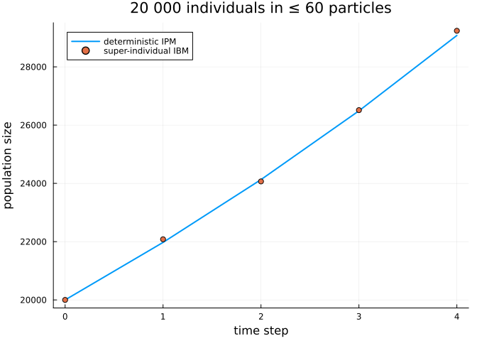
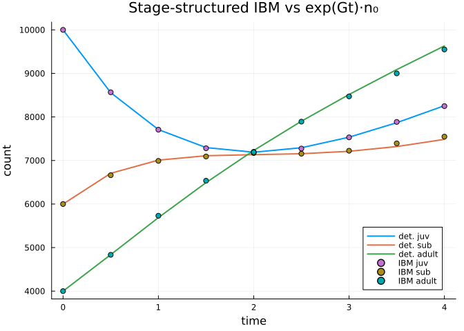

# Super-individuals and stage structure
Simon Frost

- [Overview](#overview)
- [Super-individuals](#super-individuals)
- [Exact aggregate statistics](#exact-aggregate-statistics)
- [Stage structure (pure-jump finite-state
  IBM)](#stage-structure-pure-jump-finite-state-ibm)
- [Summary](#summary)

## Overview

This vignette covers two extensions of the basic IBM:

1.  **Super-individuals** — represent a large real population with a
    small number of weighted particles, while keeping the *exact*
    aggregate count statistics.
2.  **Stage structure** — individuals carry a discrete `Stage` and jump
    between stages, i.e. an individual-based finite-state
    continuous-time Markov chain (the “pure-jump” case).

``` julia
using IndividualBasedPopulationDynamics
using IntegralProjectionModels
using StructuredPopulationCore: meshpoints, step_size
using Random, Statistics, LinearAlgebra, Plots
```

## Super-individuals

A super-individual carries a `Weight` — the number of real individuals
it represents at one trait. Demographic events use exact aggregate draws
(`Binomial(w, survival)` survivors, `Poisson(w · fecundity)` recruits),
so a sum over particles is distributionally identical to tracking every
individual — but with far fewer entities.

``` julia
survival  = LinearSurvival(1.0, 0.0)
growth    = NormalGrowth(0.5, 0.8, 0.4)
fecundity = FecundityRate(-1.0, 0.0, 1.0, 0.3, 1.0)
domain    = ContinuousDomain(0.0, 6.0, 60)
z = meshpoints(domain)
h = step_size(domain)
```

    0.1

Seed 20 000 individuals as one particle per occupied mesh bin and run,
merging back to the mesh each step to cap the particle count:

``` julia
rng = Random.Xoshiro(31)
traits0 = clamp.(2.0 .+ 0.5 .* randn(rng, 20_000), 0.01, 5.99)
n0 = zeros(Int, length(z))
for zt in traits0
    n0[clamp(floor(Int, (zt - domain.lower) / h) + 1, 1, length(z))] += 1
end
traits_s = [z[b] for b in 1:length(z) if n0[b] > 0]
weights_s = [n0[b] for b in 1:length(z) if n0[b] > 0]

world = ibm_world_super(survival, growth, fecundity, domain;
                        rng = rng, traits0 = traits_s, weights0 = weights_s)
(total = total_count(world), particles = n_particles(world))
```

    (total = 20000, particles = 39)

So 20 000 individuals are carried by only ~$60$ particles. The
total-count trajectory tracks the deterministic IPM:

``` julia
res = ibm_run_super!(world, 4; merge_domain = domain)

kernel = PKernel(survival, growth, domain) + FKernel(fecundity, domain)
detsol = solve(IPMProblem(kernel, domain, Float64.(n0), (0, 4)), DirectIteration())
det_total = [sum(u) for u in detsol.u]

plot(0:4, det_total; label = "deterministic IPM", lw = 2)
plot!(0:4, res.N; seriestype = :scatter, label = "super-individual IBM",
      xlabel = "time step", ylabel = "population size",
      title = "20 000 individuals in ≤ 60 particles")
```



The particle count stays bounded by the number of mesh bins:

``` julia
res.particles
```

    5-element Vector{Int64}:
     39
     28
     26
     24
     22

## Exact aggregate statistics

Because `Binomial` and `Poisson` draws sum exactly, super-individuals
are not merely mean-consistent — the *whole count distribution* matches.
With $K = 200$ particles of weight $50$ ($N = 10\,000$), the one-step
total has the analytic mean and variance of the full individual model:

``` julia
sconst, fconst = survival(0.0), exp(-1.0)
totals = map(1:400) do r
    w = ibm_world_super(survival, growth, fecundity, domain;
                        rng = Random.Xoshiro(1000 + r),
                        traits0 = fill(2.0, 200), weights0 = fill(50, 200))
    ibm_step_super!(w)
    total_count(w)
end
N = 10_000
(empirical = (mean(totals), var(totals)),
 analytic  = (N * (sconst + fconst), N * (sconst * (1 - sconst) + fconst)))
```

    (empirical = (10993.83, 5482.757994987467), analytic = (10989.38019801447, 5644.913744129241))

## Stage structure (pure-jump finite-state IBM)

Individuals can instead carry a discrete `Stage` and jump between stages
— the individual-based finite-state continuous-time Markov chain. Rates
are given by a transition matrix `Qtrans[s', s]` (rate $s \to s'$), a
per-stage `death` vector, and a birth matrix `birth[to, from]`:

``` julia
Qtrans = [0.0 0.0 0.0;     # 1 -> 2 at 0.5, 2 -> 3 at 0.4 (juvenile -> sub-adult -> adult)
          0.5 0.0 0.0;
          0.0 0.4 0.0]
death  = [0.1, 0.1, 0.2]
birth  = zeros(3, 3); birth[1, 3] = 0.6   # adults (stage 3) produce stage-1 offspring

stages0 = vcat(fill(1, 10_000), fill(2, 6_000), fill(3, 4_000))
sworld = ibm_world_stage(Qtrans, death, birth; rng = Random.Xoshiro(40), stages0 = stages0)
sres = ibm_run_stage!(sworld, (0.0, 4.0); dt = 0.01, saveat = 0.5, n_stages = 3)
sres.counts[1]
```

    3-element Vector{Int64}:
     10000
      6000
      4000

The mean of this jump process is the finite-state generator
$\dot n = G\,n$, with $G$ assembled from the rates. The per-stage counts
track $\exp(Gt)\,n_0$:

``` julia
G = [-0.6 0.0 0.6;
      0.5 -0.5 0.0;
      0.0 0.4 -0.2]
n0_stage = Float64.([10_000, 6_000, 4_000])
ibm_counts = reduce(hcat, [Float64.(c) for c in sres.counts])'   # rows = time, cols = stage
det_counts = reduce(hcat, [exp(G .* t) * n0_stage for t in sres.t])'

plot(sres.t, det_counts; lw = 2, label = ["det. juv" "det. sub" "det. adult"])
plot!(sres.t, ibm_counts; seriestype = :scatter,
      label = ["IBM juv" "IBM sub" "IBM adult"],
      xlabel = "time", ylabel = "count",
      title = "Stage-structured IBM vs exp(Gt)·n₀")
```



## Summary

- **Super-individuals**: `ibm_world_super` / `ibm_step_super!` /
  `ibm_run_super!` with a `Weight` per particle; `total_count` and
  `n_particles` summarize; `merge_by_bin!` caps the particle count.
  Aggregate `Binomial`/`Poisson` draws give the exact count distribution
  with far fewer entities.
- **Stage structure**: `ibm_world_stage` / `ibm_step_stage!` /
  `ibm_run_stage!` realize an individual-based finite-state CTMC whose
  mean is the generator $\exp(Gt)$.
